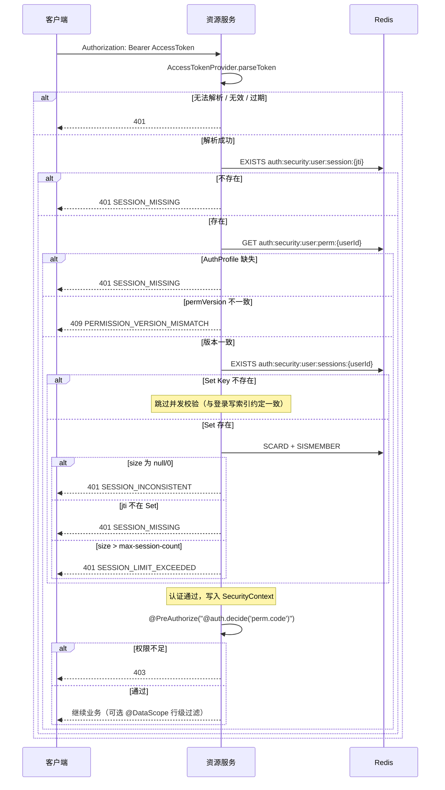
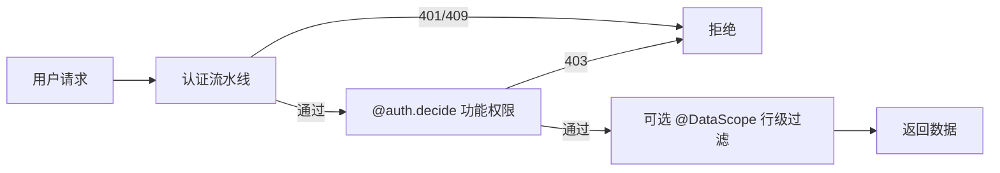

# 安全模块架构设计

> 配置项细节见《[[Security Module 配置]]》；内部服务调用见《[[内部服务调用]]》；数据权限查询规则见《[[数据权限设计]]》。

## 核心痛点

权限控制一旦和业务代码绑死，后面加数据权限、多会话、权限即时失效，只能推倒重来。  
目标不是「引一个包全自动适配」，而是 **模块化依赖 + 渐进增强**：先有 RBAC，需要行级过滤再加 data-permission，已有代码不用重写。

运行时基于 **Spring Security 6.x**。

## 模块分层（当前落地）

| 模块 | 职责 |
| ---- | ---- |
| `module-security-contract` | 跨服务契约：`AuthProfile`、`ScopeGrant`、Redis Key、异常码、失效/审计 DTO |
| `module-security-core` | Token 签发/解析（Access / Refresh / Internal）、路径匹配等纯逻辑 |
| `module-security-autoconfigure` | 资源服务 Filter 流水线、`PermissionService`、`AuthProfileCacheService`（读缓存） |
| `module-security-web-starter` | BOM 聚合；**当前只传递 autoconfigure**，数据权限需业务服务显式依赖 |
| `module-security-data-permission` | 可选：`@DataScope` + SQL 行级过滤 |

业务服务一般依赖 `module-security-web-starter`；要用 `@DataScope` 再单独加 `module-security-data-permission`。

## 安全原则

> [!IMPORTANT]
>
> **注解访问等级大于路径配置。** 下游用 `@PublicApi` / `@AuthenticatedApi` / `@InternalApi`；网关看不到注解，只认自己的路径严格配置。

### 职责切分

- **auth-gateway（`JwtValidateGlobalFilter`）**
	- 携带 `Authorization` 时做 **JWT 轻量校验**（验签、类型、可解析）；**透传**原始 Header，不改写。
	- **不**做会话 / `AuthProfile` / 权限码判断；**不**因 `X-User-Id` 之类 Header 跳过校验。
	- **无法识别**下游 `@PublicApi`，只按 `auth.gateway.security.strict-enabled` / `strict-patterns` 决定「缺 Token / Token 无效」是否直接 401。
	- **非严格路径**：缺 Token 放行；**过期 Token（`TOKEN_EXPIRED`）也放行**，过期语义交给下游；签名错误等仍 401。
- **service-auth**
	- 签发 Access / Refresh；登录编排（`LoginSessionOrchestrator`）；多会话上限（`SessionLimitGuard`）；踢人（`SessionManagementServiceImpl`）。
	- 写 Redis：`AuthProfileRedisCache`（画像）、`UserSessionRedisStore`（会话 Hash + 活跃 Set）。
- **下游业务服务**（如 service-system）
	- 对同一 Access Token 再验签、校过期；主体写入 `SecurityContext`（`AuthProfileSecurityContextPopulator`）。
	- **不信任**网关或客户端传入的用户标识 Header；身份只认 JWT `sub` / `JwtUserToken.userId`。

### Token 与画像

- **Access Token**（`AccessTokenProvider`）
	- 校验签名、`exp` 及约定声明。
	- 最小载荷：`jti`（JWT `id`）、`userId`（`sub`）、`perm_version`（`SecurityExternalTokenConstants.PERM_VERSION`）。
	- `JwtUserToken` **只**映射 `jti` / `userId` 等字段，**不含** `permVersion`；`permVersion` 落在 `SecurityTokenResult`。
- **Refresh Token**（`RefreshTokenProvider`）
	- 仅 **service-auth** 刷新接口等场景使用；资源服务不当作访问凭证。
	- JWT 自包含：`jti` + `userId`，**不带** `permVersion`；服务端用会话 Hash 里的 `UserSessionIndex.refreshTokenHash` 做防伪。
- **permVersion**
	- 角色 / 权限 / 数据范围变更时递增，写入 `AuthProfile.permVersion`。
	- 资源服务比对 JWT 快照与 Redis 画像中的权威版本；不一致 → **409** `PERMISSION_VERSION_MISMATCH`（`VersionMismatchStrategy` **尚未实现**，行为硬编码）。
- **AuthProfile**
	- 字段：`userId`、`username`、`roles`、`permissions`、`deptScope`（`ScopeGrant`）、`permVersion`。
	- Redis Key：`auth:security:user:perm:{userId}`（`SecurityRedisKey.USER_PERM`），默认 TTL **7 天**；写入侧 `AuthProfileRedisCache`，读取侧 `AuthProfileCacheService`。
	- 会话详情 Hash：`auth:security:user:session:{jti}`（`USER_SESSION`）；TTL 按 `refreshTokenExpiresAt` 动态算（枚举上的 7 天只是兜底）。
	- 活跃会话 Set：`auth:security:user:sessions:{userId}`（`USER_SESSIONS`，无固定 TTL）。
- **数据权限（画像侧）**
	- `AuthProfile.deptScope` = `DataScopeStorageType` + 部门 ID 列表（`ScopeGrant`）。
	- `user_scope` / `role_scope` 共用同一套 `scope_type`；解析规则见《[[数据权限设计]]》。

## 资源服务访问流程

入口：`ExternalRequestAuthenticator` + `SessionCountChecker`；功能权限在认证之后由 `@PreAuthorize("@auth.decide('...')")` 判定（`PermissionService`）。

并发上限配置：`auth.common.user-config.max-session-count`（默认 3）。  
注意：登录时超限走 `SessionLimitGuard` + `session-limit-strategy`（可踢最旧或拒登）；**已登录请求**超限只 401，不在资源侧踢人。

## 为什么要有会话 Hash

Refresh Token 是自包含 JWT。只有活跃 Set（`SISMEMBER`）不够防伪；会话 Hash 存 `refreshTokenHash`，刷新时对不上就删会话。

| 场景 | 只有 `USER_SESSIONS` Set | 再加 `USER_SESSION` Hash |
| ---- | ------------------------ | ------------------------ |
| Refresh 被盗 | 攻击者可直接换新 Token | hash 不匹配 → 删旧会话，下次请求 401 |
| 管理员踢人 | Set remove 即可 | 必须 **Set remove + DEL session**，少一步会漏 |

## 核心概念

| 能力 | 控制目标 | 当前实现 |
| ---- | -------- | -------- |
| **RBAC** | 能否访问接口 / 按钮 | `@PreAuthorize("@auth.decide('sys:user:add')")`（Bean 名 `auth` → `PermissionService.decide`） |
| **数据权限** | 能看见哪些行 | 可选包 `module-security-data-permission`：`@DataScope` + SQL 条件拼接 |

> 不要用 Spring 默认的 `hasPermission(...)`；本仓库统一走 `@auth.decide`。

## RBAC

### 实现要点

- 登录时解析角色、权限码、部门范围，物化成 `AuthProfile` 写入 Redis（即时生效靠改 Redis + 递增 `permVersion`，不是把权限塞进 JWT）。
- 请求侧用 `@PreAuthorize("@auth.decide('perm.code')")`。
- **保留语义**（`PermissionConstant`）：通配 `*` / `*:*` / `*:*:*` / `*:*:*:*`，角色 `ADMIN`，超级用户 ID 等——业务码不要撞这些。

### 权限变更实时性

| 存储 | 变更后怎么生效 | 本项目 |
| ---- | -------------- | ------ |
| 只放 JWT | 重新登录或 Refresh | 不采用（权限不进 Access Token） |
| Redis 画像 + JWT 里的 `perm_version` 快照 | 更新 Redis / 升版本；不匹配返回 409 | **当前方案** |

## 数据权限

接口权限和行级过滤拆开：

- 接口：`@auth.decide`
- 行级：依赖 `module-security-data-permission`，按 `AuthProfile.deptScope` 在 SQL 层加条件

查询合并规则（user_scope 优先、角色宽松合并、默认 SELF、管理员 ALL）见《[[数据权限设计]]》。

## 已知风险 / 缺口

1. **`VersionMismatchStrategy` 未落地**：permVersion 冲突一律 409，没有「强制重新登录 / 仅提示刷新」等可配策略。
2. **`USER_SESSIONS` 缺失时跳过并发校验**：依赖登录写索引的约定；索引丢了不会因「不在 Set」挡请求（仍靠 session Hash + AuthProfile）。
3. **踢人必须双删**：漏删 session Hash 或 Set 任一端，会出现「看起来还在线」或「Token 还能用」的空窗。
4. **网关非严格路径放行过期 Token**：下游必须自己校过期；别假设网关已经帮你挡干净。
5. **web-starter 尚未聚合 data-permission**：以为「引了 starter 就有 `@DataScope`」会踩空，要显式加依赖。
