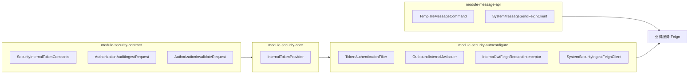
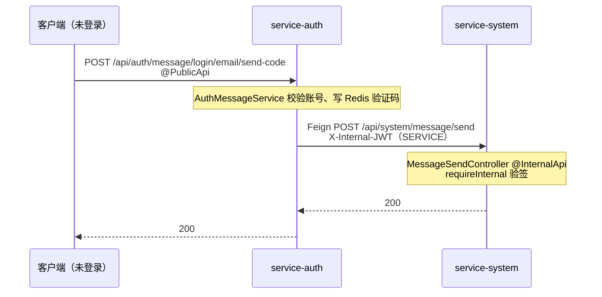

## 内部服务间调用

> 按 auth-server **当前实现**对齐。痛点就一句话：服务间互调不能靠路径白名单，也不能把用户 `Authorization` 瞎传下去；统一用 `@InternalApi` + 短命 `X-Internal-JWT`。

### 设计原则

1. **鉴权不靠路径白名单**：内部接口的安全边界由 **`@InternalApi` + `X-Internal-JWT` 验签** 决定，而非 `auth.common.security.permit-paths` 或网关 `internal-paths`（后者当前未实现）。
2. **路径仅为约定**：内部 HTTP 入口多放在 `/api/**/inner/**`（Swagger 亦按此匹配），但**未**标 `@InternalApi` 的 `/inner` 路径不会自动变成「仅内部可访问」。
3. **出站自动挂令牌**：微服务间 HTTP 走 OpenFeign（及负载均衡 RestTemplate）；全局拦截器自动签发/剥离内部令牌，**禁止**业务代码手工传播 `Authorization` 或 `X-Internal-JWT`。
4. **双模身份**：出站按当前安全上下文智能签发——
   - 有登录用户（`AuthProfile.userId` 非空）→ `principal_type=USER`，入站从 Redis 加载完整画像
   - 无用户上下文（公开接口、定时任务、MQ 等）→ `principal_type=SERVICE`，入站仅最小化服务身份

### 模块分层

跨服务 DTO / 常量 / SPI 放独立 `module-*-api` 或 `module-security-contract`；运行时鉴权与出站拦截由 security starter 装配；HTTP 入口与编排在各 `service-*`。

| 模块 | 职责（内部调用相关） | 典型类 |
| ---- | -------------------- | ------ |
| **module-security-contract** | 跨服务常量、审计/失效 DTO | `SecurityInternalTokenConstants`、`AuthorizationAuditIngestRequest`、`OperationLogIngestRequest`、`AuthorizationInvalidateRequest` |
| **module-security-core** | 内部 JWT 签发/解析（USER / SERVICE） | `InternalTokenProvider` |
| **module-security-autoconfigure** | `@InternalApi`、过滤器、认证执行器、出站拦截、审计 Feign | `InternalJwtFeignRequestInterceptor`、`SystemSecurityIngestFeignClient` |
| **module-message-api** | 消息发送命令与 Feign | `TemplateMessageCommand`、`SystemMessageSendFeignClient` |
| **module-file-api** | 文件归属校验/撤销 Feign | `SystemFileRecordFeignClient` |

**依赖关系（简述）**：业务服务编译期依赖 **contract**（及按需 **message-api / file-api**）；引入 security starter 后自动装配 **core + autoconfigure**（含 Feign / RestTemplate 出站拦截器）。

### 注解与认证链路

标有 `@InternalApi`（类或方法）的接口，由 `InternalApiRule` 解析为 `SecurityRequirement.INTERNAL`，经 `TokenAuthenticationFilter` 分派到 `AuthAction.REQUIRE_INTERNAL` → `SecurityAuthExecutor.requireInternal()`：

| 行为 | 说明 |
| ---- | ---- |
| 必须携带 Header | `X-Internal-JWT`（`SecurityInternalTokenConstants.INTERNAL_HEADER`） |
| 禁止凭证 | 外部 `Authorization` Bearer **不能**作为 `@InternalApi` 的合法凭证（`requireInternal` 只走内部认证器） |
| 入站身份 | 接受 `principal_type=USER` 或 `SERVICE`；未知类型 → `TOKEN_INVALID` |
| USER 画像 | 按 `userId` 读 Redis `:user:perm:{userId}`；缓存缺失 → `PROFILE_CACHE_MISS` |
| SERVICE 画像 | 最小化 `AuthProfile`：角色 `INTERNAL_SERVICE` + `username=service_id`，**无** `userId` / `sessionId` / `permVersion` / `deptScope` |

未标 `@InternalApi` 的接口走 `SecurityRequirement.FALLBACK_TO_PATH` → `AuthAction.TRY`（尝试认证，不强制内部令牌）。详见 [已知风险](#已知风险)。

**相关类**（`module-security-autoconfigure`）：

- `InternalApiRule` / `SecurityRequirementResolver` / `TokenAuthenticationFilter`
- `InternalRequestAuthenticator` / `SecurityAuthExecutor`
- `OutboundInternalJwtIssuer` / `InternalJwtFeignRequestInterceptor` / `InternalJwtClientHttpRequestInterceptor`

### 出站：OutboundInternalJwtIssuer

Feign（`InternalJwtFeignRequestInterceptor`）与负载均衡 RestTemplate（`InternalJwtClientHttpRequestInterceptor`）共用同一签发器。每次出站请求：

1. **移除** `Authorization` 与可能残留的 `X-Internal-JWT`（避免误传播）
2. **签发** 内部 JWT（见下表）
3. **写入** Header `X-Internal-JWT`

| 条件 | 签发方法 | 关键 claim |
| ---- | -------- | ----------- |
| `SecurityContext` 有 `userId` | `InternalTokenProvider.buildToken(userId, jti, permVersion)` | `sub=userId`，`principal_type=USER` |
| 无用户上下文 | `InternalTokenProvider.buildServiceToken(serviceId, jti)` | `sub=0`（`SERVICE_SUB_PLACEHOLDER`），`service_id=spring.application.name`，`principal_type=SERVICE` |

`jti` 均为随机 UUID；TTL 见下文。

> **实现缺口**：`buildToken` 虽接收 `permVersion` 参数，**当前未写入 JWT claim**；入站 USER 分支的版本比对因此多数情况下不会触发（`result.getPermVersion()` 为 null）。见 [已知风险](#已知风险)。

### 入站：InternalRequestAuthenticator

1. `supports()`：`X-Internal-JWT` Header 非空
2. `authenticate()`：验签并解析 `principal_type`
   - **USER**：`loadUserProfile(userId, tokenPermVersion)` —— 读 Redis 画像；若令牌带 `permVersion` 且与缓存不一致 → `PERMISSION_VERSION_MISMATCH`
   - **SERVICE**：`buildServiceProfile(serviceId)` —— 不访问 Redis
3. 填充 `SecurityContext`

外部认证器（`ExternalRequestAuthenticator`）在检测到内部 Header 时直接 `supports=false`，避免与 Bearer 抢解析。

### 内部令牌 TTL

硬编码 **60 秒**（`INTERNAL_MAX_TTL_SECONDS`，定义于 `module-security-contract`），**不** 进入 Nacos，避免配置误改扩大内部令牌窗口。

### 典型调用链

#### 1. 登录发验证码（SERVICE 令牌）

登录发消息不需要用户在 system 侧登录；用户只访问 auth 的公开接口，auth 经 Feign 代调 system。此时 auth 侧无登录用户 → 出站签 **SERVICE**。

要点：

- **auth 入口**：`AuthMessageController` 使用 `@PublicApi`
- **system 入口**：`MessageSendController.send` 使用 `@InternalApi`（路径在 `/api/system/message/send`，**非** `/inner`，但注解生效）
- **Feign**：`SystemMessageSendFeignClient`（`module-message-api`）→ `POST /api/system/message/send`；请求体 `TemplateMessageCommand`

#### 2. 有用户上下文的链式调用（USER 令牌）

管理员在 system 侧操作，Feign 调 auth 内部接口时：出站拦截器读到当前 `AuthProfile` → 签 **USER** → auth 入站从 Redis 重建画像。下游若 Mapper 带 `@DataScope`，可读到完整 `userId` / `deptScope`。

### 与数据权限（@DataScope）的关系

数据权限插件（`module-security-data-permission`）从 `SecurityContext` 读 `AuthProfile`，依赖 `userId` 与 `deptScope` 拼 SQL。

| 场景 | 行为（当前实现） |
| ---- | ---------------- |
| `@InternalApi` + **SERVICE** 令牌 + Mapper `@DataScope` | `profile` 无 `userId` → `buildCondition` 返回 `null` → **不追加行级条件**（可能查全表） |
| `@InternalApi` + **USER** 令牌 + Mapper `@DataScope` | 画像来自 Redis → **按用户 deptScope 追加条件**（与外部请求一致） |
| 内部接口显式传 `userId`，Service 内按 ID 查库 | **正常**（不依赖 SecurityContext 用户） |
| 示例：`GET .../principal/{userId}/effective-codes` | `AdminAuthorizationService.getEffectiveCodes(userId)` 按路径参数查，**不受** 令牌类型限制 |

**内部接口设计规范**：

1. **系统能力类**（发消息、写审计、踢会话）：无需 `@DataScope`；`@InternalApi` + 内部令牌即可。无用户上下文时自然走 SERVICE。
2. **代用户查数且不能依赖透传画像**：路径/Body **显式传 `userId`**，在应用层加载 scope；不要假设 SecurityContext 一定是目标用户。
3. **需要继承调用方行级权限**：确保调用方线程有登录用户，让出站自动签 USER；下游即可用 `@DataScope`。

### 当前已落地的内部 HTTP 入口（代码盘点）

| 服务 | Controller | 路径 | `@InternalApi` | 说明 |
| ---- | ---------- | ---- | -------------- | ---- |
| service-auth | `AuthorizationInnerController` | `/api/auth/inner/authorization/**` | 是 | `effective-codes`、`invalidate`、失效幂等事件查询/释放 |
| service-auth | `SessionInnerController` | `/api/auth/inner/sessions/**` | 是 | 批量踢下线、查活跃会话、踢指定会话 |
| service-system | `InternalSecurityIngestController` | `/api/system/inner/authorization-audit/records`、`.../operation-log/records` | 是 | 授权审计、操作日志上报 |
| service-system | `MessageSendController` | `POST /api/system/message/send` | 是 | 统一消息发送；**非** `/inner` 路径 |
| service-system | `InternalAuditUserDisplayController` | `POST /api/system/inner/audit-user/usernames` | 是 | 批量解析审计展示名 |
| service-system | `InternalFileRecordController` | `/api/system/inner/file-records/**` | 是（类级） | 文件归属校验、撤销活跃文件 |

**Feign 客户端**（生产代码，不含 `service-example`）：

| 定义位置 | 接口 | 目标服务 | 目标路径 | 契约依赖 |
| -------- | ---- | -------- | -------- | -------- |
| `module-security-autoconfigure` | `SystemSecurityIngestFeignClient` | service-system | `/api/system/inner/authorization-audit/records`、`.../operation-log/records` | `module-security-contract` |
| `module-message-api` | `SystemMessageSendFeignClient` | service-system | `/api/system/message/send` | `TemplateMessageCommand` |
| `module-file-api` | `SystemFileRecordFeignClient` | service-system | `/api/system/inner/file-records/**` | file-api request DTO |
| service-system-authorization | `AuthorizationInnerFeignClient` | service-auth | `/api/auth/inner/authorization/**`（含 invalidate、event） | contract 失效 DTO；本地 `EffectiveCodesInnerDTO` 等 |
| service-system-authorization | `MeSessionInnerFeignClient` | service-auth | `/api/auth/inner/sessions/users/{userId}/**` | 本地 `UserSessionRemoteDTO` |
| service-system-authorization | `SessionRevocationInnerFeignClient` | service-auth | `/api/auth/inner/sessions/kick-all` | — |

### 网关侧行为

网关 **不识别** `@InternalApi` / `@PublicApi`；**暂无** `internal-paths` 配置（见《Gateway 网关说明》）。

- 公网若可路由到 `/api/**/inner/**` 或 `/api/system/message/send`：无合法 `X-Internal-JWT` 时，标了 `@InternalApi` 的下游返回 401。
- **未**标 `@InternalApi` 的内部路径：仍可能被携带用户 Bearer 的请求访问（取决于 `FALLBACK_TO_PATH` + 是否 `@PreAuthorize`）。
- 网关 **不能** 替代服务侧 `@InternalApi`；生产环境建议在网关或网络层额外限制 inner 路径暴露面。

## 已知风险

与正文「设计原则」区分：原则 = 目标行为；本节 = 尚未对齐或已知缺口。

### 安全 / 注解语义

| 问题 | 现状（代码） | 影响 | 建议 |
| ---- | ------------ | ---- | ---- |
| **未标 `@InternalApi` 时，内部 JWT 仍可认证** | `requestAuthenticators` 顺序：Internal 先于 External；`TRY` 模式下有 `X-Internal-JWT` 即填充 SecurityContext | 与「仅 `@InternalApi` 接受内部令牌」的直觉不一致；依赖开发者自觉标注 | 文档约束 + Code Review；可选：非 `@InternalApi` 拒绝纯内部 JWT |

### 令牌 / 契约

| 问题 | 现状（代码） | 影响 | 建议 |
| ---- | ------------ | ---- | ---- |
| **USER 内部令牌未写入 `permVersion` claim** | `OutboundInternalJwtIssuer` 传入 `permVersion`；`InternalTokenProvider.buildToken` **未**写入 JWT；入站比对常被跳过 | 权限变更后，短窗口内 USER 内部调用可能仍用旧画像语义（主要依赖 Redis 当前值，令牌侧版本闸门未生效） | 对齐 Access Token：签发时写 `perm_version`，解析时填入 `SecurityTokenResult` |
| **`EffectiveCodes` 跨服务 DTO 未入 contract** | auth 侧 `EffectiveCodesVO`；system 侧 Feign 本地 `EffectiveCodesInnerDTO` | 字段靠 JSON 对齐，无编译期契约 | 迁入 `module-security-contract` 或独立 `*-api` |
| **会话 / 失效事件 Feign DTO 散落本地** | `UserSessionRemoteDTO`、`AuthorizationInvalidationEvent*InnerDTO` 等在 system-authorization | 同上 | 按需上收 contract / api 模块 |

### 基础设施

| 问题 | 现状（代码） | 影响 | 建议 |
| ---- | ------------ | ---- | ---- |
| **网关无 inner 路径隔离** | 无 `internal-paths`；默认 strict 不覆盖 inner | 依赖下游 `@InternalApi`；若遗漏注解则暴露面大 | Nacos 增加 inner 路径拒绝或 mTLS / 内网隔离 |
