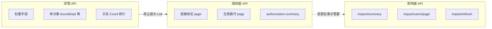
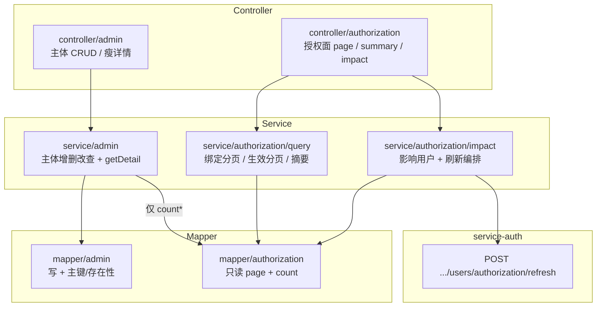

# 授权面与详情设计规范

## 1. 设计背景与核心目标

详情接口曾经把部门、岗位、角色、权限、菜单等关系整表塞进 VO。角色权限多、组织人多，响应体膨胀、打开详情/工作台变慢。

写侧已有自动失效（改分配 → Outbox → 重建用户画像）。读侧要拆三件事：

- **瘦详情（Lean Detail）**：详情只回标量 + 关系 Count，不嵌大 List
- **授权面（Authorization Surface）**：直接绑定 / 生效展开一律独立 `page`
- **影响面（Impact Domain）**：角色变更影响分析与画像刷新单独编排，手动刷新入口收敛
- **包边界**：`admin` 管 CRUD；`authorization` 管跨表只读与影响编排，禁止往 CRUD 服务里堆

> [!IMPORTANT]
> 登录侧「分批」是多人失效时按用户 ID 分批，不是单用户角色/权限翻页。别和授权面分页混谈。



## 2. 读模型形态与边界分类

| 形态 | 承载位置 | 典型示例 | 约束 |
|------|----------|----------|------|
| **标量** | 详情 Description / 基础 VO | `username`、`roleCode`、`status` | 基础属性 |
| **单对象** | 详情内嵌（不分页）| 岗位所属部门 `boundDept` | 仅限基数 ≈ 1 |
| **数字 (Count)** | 详情统计条 | `permissionCount`、`deptCount` | 点进授权面的入口 |
| **分页列表** | 仅授权面 / 影响面 API | `*/page`、`impact/users/page` | 严禁嵌进详情 |

## 3. 服务分层与包结构

按能力域拆：主体 CRUD（`admin`）、授权只读（`query`）、影响编排（`impact`）。



### 3.1 包结构（`service-system-admin`）

```text
com.auth.service.system.admin/
├── controller/
│   ├── admin/              # 主体 CRUD、瘦详情、授权写（replace）
│   ├── authorization/      # 授权面 / 影响面 HTTP
│   └── me/                 # 自服务 API
├── service/
│   ├── admin/              # 实体增删改查 + 瘦详情 getDetail
│   ├── me/
│   └── authorization/
│       ├── query/          # 只读授权面（绑定/生效分页、摘要）
│       └── impact/         # 角色影响面（影响用户、画像刷新）
├── mapper/
│   ├── admin/              # 实体写 + 主键/存在性校验
│   └── authorization/      # 只读分页与 Count（跨表关系边）
└── model/vo/authorization/
```

### 3.2 域职责

| 包 | 允许 | 禁止 |
|----|------|------|
| `service/admin` | Entity CRUD、启停、导入导出、`getDetail` 标量与 Count、写替换（如 grant-subjects PUT）| 生效展开分页、影响用户列表、跨 Feign 刷新编排往里堆 |
| `service/authorization/query` | Summary、各类 `*Page` 只读 | 改 grant_table、改角色权限 |
| `service/authorization/impact` | 影响摘要、影响用户 page、触发画像刷新 | 主体 CRUD |
| `support` | 存在性校验、闭包、拼 order by | 对外业务用例入口 |

读写分口示例：角色授权对象 **读** 在 `controller/authorization`（`grant-subjects/page`、`ids`）；**写** 在 `controller/admin`（`PUT.../grant-subjects`）。

## 4. 交互边界与约束

| 视图 | 放什么 | 不放什么 |
|------|--------|----------|
| **详情 Dialog** |「查看授权」进授权面 |「刷新授权」|
| **用户授权 / 安全页** |「刷新当前用户画像」→ `POST /api/auth/admin/users/authorization/refresh` |—|
| **角色影响分析抽屉** | 影响用户分页 + `impact/refresh`（主入口）| 挂在角色普通详情上 |
| **角色授权面** | 分页查询；可链到影响分析 | 每个 Tab 都刷一遍 |
| **部门 / 岗位授权面** | Summary + 分页列表 | 默认不挂刷新主按钮 |
| **权限 / 菜单授权面** | 绑定角色分页 | 刷新 |
| **运维 · 授权失效页** | 重试/补救（已有）| 业务页再复制一套 |
