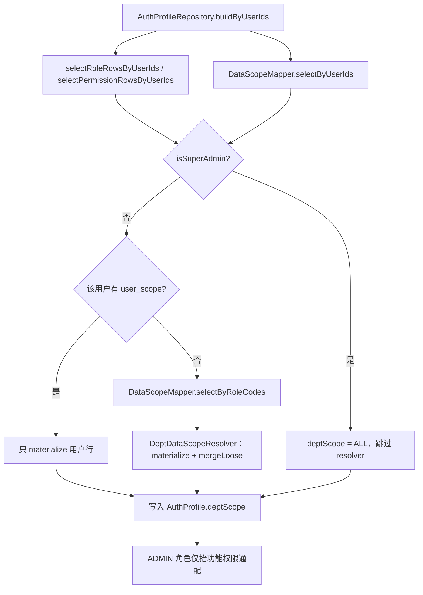

# 数据权限设计

## 痛点

接口权限（RBAC）只管「能不能进这个接口」，管不了「这一页能看见哪些行」。

如果把部门范围塞进 JWT，权限一变就要等 Token 过期；如果每个业务 SQL 自己手写 `dept_id IN (...)`，规则一改全项目散弹。所以项目把**生效后的部门范围**算进 `AuthProfile.deptScope`，请求期再由 `@DataScope` 往 SQL 上拼条件。

## 生效规则

优先级从高到低：

1. **超管**：`PermissionConstant.isSuperAdmin(userId)`（当前内置 `userId=1`）→ `deptScope = ALL`，不查 `role_scope`，也不进 resolver。
2. **用户覆盖**：`user_scope` 有行 → 以该行生效，**完全忽略**角色范围。
3. **角色合并**：无 `user_scope` → 用 `grant_table` 展开出的角色码查 `role_scope`，多角色用 `DeptScopeMerger.mergeLoose`（最宽松：`ALL` 优先；部门 ID 取并集；任一条是 `DEPT_AND_CHILD` 则结果类型也是它）。
4. **兜底**：两边都没有，或合并结果为 `null` → `SELF`。

> [!IMPORTANT]
> **ADMIN 角色 ≠ 数据全量。**  
> `isAdminRole` 只把功能权限抬成通配（`*` / `*:*` …），`deptScope` 仍走上面 2～4。不要把「功能管理员」和「看全部数据」混为一谈。

存储类型（`user_scope` / `role_scope` 共用）：`ALL`、`SELF`、`DEPT`、`DEPT_AND_CHILD`。  
`FROM_PROFILE` 只给注解占位，不入库。

`DEPT_AND_CHILD` 在画像构建时就会经 `dept_closure` 展开成部门 ID 列表写进 `ScopeGrant.values`；请求期 SQL 直接 `IN (...)`，不再二次查闭包。

## 构建路径

入口在 `AuthProfileRepository#buildByUserIds`（批量），不是单用户逐步查。

解析细节在 `DeptDataScopeResolver#resolveEffectiveGrants`：

- 调用方预加载 `user_scope`、`role_scope`、角色码 Map。
- 仅对 `DEPT_AND_CHILD` 锚点批量调 `DeptClosureMapper#selectDescendantRowsByAncestorIds`，再按锚点分组展开。
- `materializeRow` 把库表行变成 `ScopeGrant`；角色侧再 `mergeLoose`。

## 查询契约（auth 画像构建）

管理端 CRUD 另有 `service-system` 的 `UserScopeMapper` / `RoleScopeMapper`（`BaseMapper`），**不要**跟下面这套只读契约混用。

| 能力 | 实际 API | 说明 |
|------|----------|------|
| 用户角色码 | `UserAuthorizationGrantMapper#selectRoleRowsByUserIds` | `grant_table` + 主体展开 → `role_code` |
| 用户范围 | `DataScopeMapper#selectByUserIds` | 读 `user_scope`；有行即覆盖，无单独 `count` |
| 角色范围 | `DataScopeMapper#selectByRoleCodes` | `role_scope` 经 `sys_role` 桥 `role_code`；空列表 `1=0` |
| 子部门展开 | `DeptClosureMapper#selectDescendantRowsByAncestorIds` | 返回锚点-后代配对行（含自身） |

超管与「已有 `user_scope`」的用户不会进入 `selectByRoleCodes` 的候选角色集合。

## 请求期怎么用

画像进 Redis 后，业务 Mapper 方法挂 `@DataScope`，`DefaultDataScopeHandler` 按 `AuthProfile.deptScope` 拼条件：

| `scopeType` | SQL 行为 |
|-------------|----------|
| `ALL` / 超管 | 不加条件 |
| `SELF` | `{alias}.{userColumn} = userId` |
| `DEPT` / `DEPT_AND_CHILD` | `{alias}.{dimensionColumn} IN (values)`；values 空则 fail-close `1 = 0` |

注解可强制 `scope`（非 `FROM_PROFILE` 时压过画像）。复杂跨库/多维过滤仍应手写，别硬塞注解。

## 风险

1. **ADMIN 配了很窄的 `role_scope`**：功能上几乎全能，数据上可能只能看一小撮部门——这是刻意拆分，配置时别想当然。
2. **`user_scope` 一行覆盖全部角色**：给用户写了 `SELF`，角色上再宽也没用。
3. **闭包表脏了**：`DEPT_AND_CHILD` 展开会漏子部门；维护 `dept_closure` 是正确性前提。
4. **画像是算好缓存的**：改 scope / 改授权后必须推权限版本（`permVersion`），否则旧 `deptScope` 会继续生效到缓存刷新。
