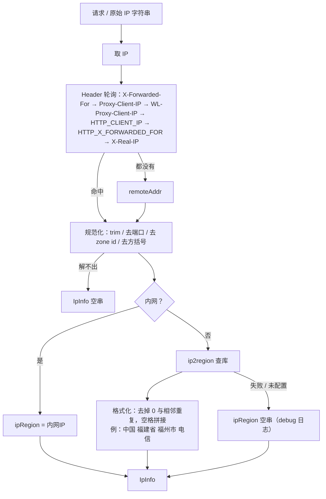

# IP 工具

登录日志、会话、操作审计都要写「客户端 IP + 归属地」。各服务自己抠 Header、自己接 ip2region，迟早各写一套。这个 starter 把这件事收成一个 Bean：注入就能用。

依赖 `ip2region`（父工程管版本，当前 3.x）+ Hutool；挂上 classpath 后自动配置，对外入口是 `IpAddressService`。

## 怎么用

注入后三选一：

```java
IpInfo info = ipAddressService.resolveCurrentRequestIpInfo(); // 当前线程绑定的 request
IpInfo info = ipAddressService.resolveIpInfo(request);         // 显式传 request（登录/审计常用）
IpInfo info = ipAddressService.resolveIpInfo("8.8.8.8");       // 只查字符串
```

`IpInfo` 两个字段：

| 字段 | 含义 |
|------|------|
| `ipAddr` | 规范化后的 IP；解不出就是空串 |
| `ipRegion` | 归属地文案；内网固定 `内网IP`；库没有/关了/查失败就是空串 |

返回值不会是 `null`。库挂了、路径写错了：**不挡启动**，启动 warn 一次，查询降级成空归属地。

业务侧例子：登录审计 / 会话索引里 `resolveIpInfo(request)`；改密记 IP 时取 `.getIpAddr()`。

## 怎么配

前缀 `auth.common.ip-tool`。路径必须是**本地文件**（Docker 挂 `/opt/ipdb`），不是 classpath。

```yaml
auth:
  common:
    ip-tool:
      resolve-external-enabled: true
      resolve-ipv6-enabled: false
      ipv4-db-path: /opt/ipdb/ip2region_v4.xdb
      ipv6-db-path: /opt/ipdb/ip2region_v6.xdb
```

> [!TIP]
>
> xdb 从哪来、Release 只带 v4：见 `assets/Release/ipdb/README.md`。官网：https://ip2region.net，开源数据：https://github.com/lionsoul2014/ip2region/tree/master/data。

| 配置 | 默认 | 干什么 |
|------|------|--------|
| `resolve-external-enabled` | `true` | `false` 时公网也不查库，内网判断还在 |
| `resolve-ipv6-enabled` | `false` | `false` 时不加载 v6 库，IPv6 归属地为空 |
| `ipv4-db-path` | 无 | v4 xdb 绝对路径 |
| `ipv6-db-path` | 无 | v6 xdb；只有上面开关打开才会读 |

## 解析链路


> [!NOTE]
> `X-Forwarded-For` 取逗号后第一段；不解析 RFC `Forwarded` 头。查库失败不挡业务，仍返回带 IP、归属地为空的 `IpInfo`。





## 风险

启动用 **全内存**（`loadContentFromFile` + buffer），堆大约等于 xdb 文件大小；每个启用解析的进程各一份。开源 v4 ~11MB、v6 ~35MB；大商用库会线性变重。

默认建议只挂 v4、关掉 `resolve-ipv6-enabled`。内存 / OOM 处理见 [IP工具问题](常见问题/IP工具问题.md)。
