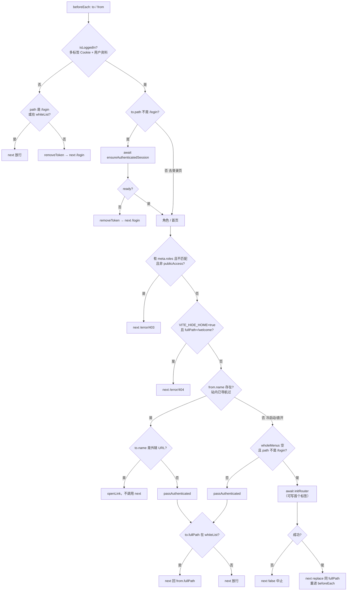

# 前端路由策略

鉴权与动态路由都在 `createAuthGuard`（`auth-web/src/router/guards/auth.ts`）。静态路由启动就有；后端菜单路由靠 `initRouter` + `addRoute`。白名单目前只有 `/login`。

```mermaid
flowchart TD
  A[beforeEach: to / from] --> B{"isLoggedIn?<br/>多标签 Cookie + 用户资料"}
  B -->|否| C{path 是 /login<br/>或在 whiteList?}
  C -->|是| D[next 放行]
  C -->|否| F["removeToken → next /login"]

  B -->|是| G{to.path 不是 /login?}
  G -->|是| H[await ensureAuthenticatedSession]
  H --> I{ready?}
  I -->|否| F2["removeToken → next /login"]
  I -->|是| J[角色 / 首页]
  G -->|否 去登录页| J

  J --> K{"有 meta.roles 且不匹配<br/>且非 publicAccess?"}
  K -->|是| L["next /error/403"]
  K -->|否| M{"VITE_HIDE_HOME=true<br/>且 fullPath=/welcome?"}
  M -->|是| N["next /error/404"]
  M -->|否| O{"from.name 存在?<br/>站内已导航过"}

  O -->|是| P{"to.name 是外链 URL?"}
  P -->|是| Q["openLink，不调用 next"]
  P -->|否| R[passAuthenticated]

  O -->|否 冷启动/直开| S{"wholeMenus 空<br/>且 path 不是 /login?"}
  S -->|是| T["await initRouter<br/>（可写首个标签）"]
  T --> T1{成功?}
  T1 -->|否| T2["next false 中止"]
  T1 -->|是| T3["next replace 同 fullPath<br/>重进 beforeEach"]
  S -->|否| R2[passAuthenticated]

  R --> U{"to.fullPath 在 whiteList?"}
  U -->|是| V["next 回 from.fullPath"]
  U -->|否| W[next 放行]
  R2 --> U
```
