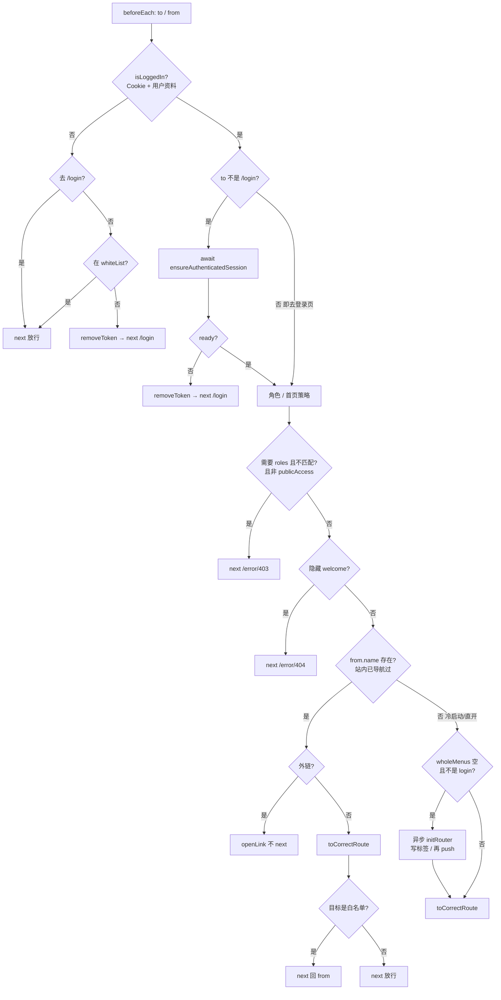

```mermaid
flowchart TD
  A[beforeEach: to / from] --> B{isLoggedIn?<br/>Cookie + 用户资料}
  B -->|否| C{去 /login?}
  C -->|是| D[next 放行]
  C -->|否| E{在 whiteList?}
  E -->|是| D
  E -->|否| F[removeToken → next /login]

  B -->|是| G{to 不是 /login?}
  G -->|是| H[await ensureAuthenticatedSession]
  H --> I{ready?}
  I -->|否| F2[removeToken → next /login]
  I -->|是| J[角色 / 首页策略]
  G -->|否 即去登录页| J

  J --> K{需要 roles 且不匹配?<br/>且非 publicAccess}
  K -->|是| L[next /error/403]
  K -->|否| M{隐藏 welcome?}
  M -->|是| N[next /error/404]
  M -->|否| O{from.name 存在?<br/>站内已导航过}

  O -->|是| P{外链?}
  P -->|是| Q[openLink 不 next]
  P -->|否| R[toCorrectRoute]

  O -->|否 冷启动/直开| S{wholeMenus 空<br/>且不是 login?}
  S -->|是| T[异步 initRouter<br/>写标签 / 再 push]
  S -->|否| R2[toCorrectRoute]
  T --> R2

  R --> U{目标是白名单?}
  U -->|是| V[next 回 from]
  U -->|否| W[next 放行]

```