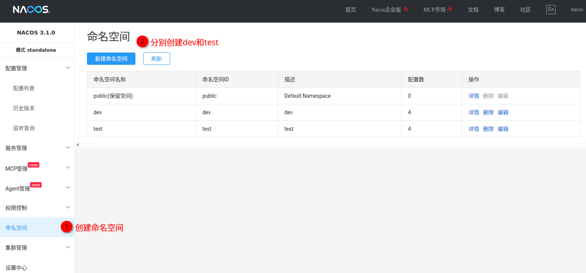
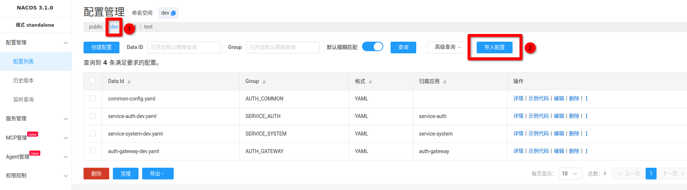

## Nacos 配置导入

> [!NOTE]
>
> 由于每次开发和内侧时会修改里面的一些连接配置，例如数据库、Redis 等配置，在导入后需要自行修改里面的配置项！

1. 打开 Nacos
2. 创建命名空间 `dev`

1. 将该目录下的 `dev.zip` 导入到配置中

> [!NOTE]
>
> 正常情况只有下面这几个配置文件

1. **修改里面的数据库、用户名、密码、Redis 等**

> [!IMPORTANT]
>
> 一定要修改，每个人的 IP 地址和数据库可能不一样！
