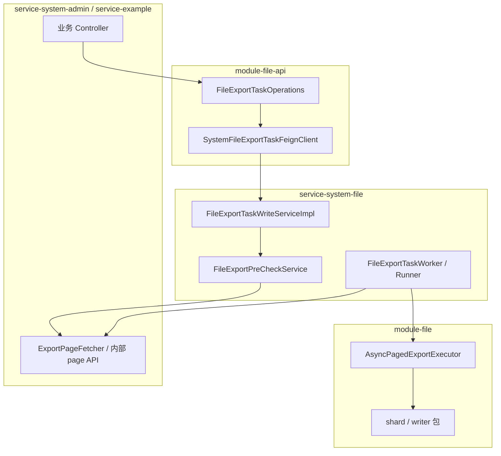

## 1. 概览

在仓库中定位模块与类、沿调用链阅读实现、评估扩展点

建议阅读顺序：先通读设计文档第 1～3 章与第 8～9 章，再按本文第 4 节「推荐阅读路径」进入代码。

## 2. 模块分层

异步导出能力横跨 **契约模块**、**引擎模块** 与 **业务/文件服务**，依赖方向为单向：`service-*` → `module-file-api` + `module-file`，引擎不反向依赖业务服务。

```text
auth-server/
├── modules/
│   ├── module-file-api/     # 跨模块契约：Port、DTO、Feign、自动装配
│   └── module-file/         # 导出引擎：分页执行、分片、写盘、打包（无 Spring Service）
│
└── services/
    ├── service-system/
    │   ├── service-system-file/    # 任务持久化、Worker、前置检查、产物上传
    │   └── service-system-admin/   # 平台业务导出端点 + 内部分页取数
    │
    └── service-example/            # 独立微服务接入示例
```

### 2.1 各模块职责

| 模块 | 职责 | 不得承担 |
|------|------|----------|
| **module-file-api** | 定义 `FileExportTaskOperations` Port；暴露 `ExportPreCheckRequest` / `ExportPreCheckResult` 等 DTO；提供 Feign 与远程 Port 实现 | 任务持久化、Worker 调度、业务查询 |
| **module-file** | 分页写出、分片会话、ZIP 打包、列/权限快照工具、导出异常体系 | 感知具体业务表或 Mapper |
| **service-system-file** | 任务表读写、租约抢占、前置检查编排、远程分页回调、产物上传、用户/管理端任务 API | 实现各 `bizType` 的列表查询 |
| **service-system-admin** | 平台业务 `export/pre-check`、`export/async`；`ExportPageFetcher` 注册与内部分页接口 | 写 Excel、维护任务状态机 |
| **service-example** | 演示跨服务部署时的 Feign 接入与独立取数路径 | 与 admin 共用 Fetcher 注册表 |

### 2.2 依赖关系示意



## 3. 包结构与类索引

以下按**代码阅读优先级**排列，而非字母序。

### 3.1 契约层（`module-file-api`）

| 类 / 接口 | 包路径 | 职责 |
|-----------|--------|------|
| `FileExportTaskOperations` | `...api.port` | 跨模块 Port：`preCheck`、`createTask` |
| `RemoteFileExportTaskOperations` | `...api.port.remote` | Feign 适配器，实现上述 Port |
| `SystemFileExportTaskFeignClient` | `...api.feign` | 调用文件服务内部接口 |
| `ExportPreCheckRequest` | `...api.model.request` | 前置检查入参：`bizType`、取数路由、查询快照 |
| `ExportPreCheckResult` | `...api.model.dto` | 前置检查结果：`status`、`totalRows`、`shardCount`、`exportFormat` 等 |
| `ExportPreCheckStatus` | `...api.model.enums` | `NORMAL` / `SHARDED` / `EXCEEDED` |
| `FileExportTaskCreateRequest` | `...api.model.request` | 创建任务：含列快照、取数路由、幂等键 |
| `ExportPageDataDTO` | `...api.model.dto` | 内部分页回调响应：`records` + `total` |
| `FileFeignAutoConfiguration` | `...api.boot` | 无本地 Bean 时注册 Feign 与远程 Port |

业务 Controller **仅依赖** `FileExportTaskOperations`，不得直接依赖 Feign Client（架构测试约束）。

### 3.2 引擎层（`module-file`）

引擎与 Spring 业务层解耦，可在单测中独立验证。

#### 3.2.1 执行编排

| 类 | 包路径 | 职责 |
|----|--------|------|
| `AsyncPagedExportExecutor` | `export.executor` | 分页循环、取消检测、进度回调、调用分片会话与打包器 |
| `FileExportTaskContext` | `export.task` | 单次导出运行时上下文（含 `maxRows`、`shardRows`、各类快照）|
| `FileExportTaskArtifact` | `export.task` | 写出完成后的产物：路径、文件名、MIME、行数 |
| `PageDataSource` | `export.datasource` | 分页数据源抽象 |
| `RemotePageDataSource` | `export.datasource` | 基于 HTTP 回调的 `PageDataSource` 基类 |

#### 3.2.2 分片与打包（`export.shard`）

| 类 | 职责 |
|----|------|
| `ExportShardPolicy` | 总上限 `maxRows`、分片阈值 `shardRows`；`shardCount` 计算；执行期硬校验 `assertWithinMaxRows` |
| `ChunkFileSession<R>` | 单个物理文件写盘会话：`writeChunk` → `complete` → `close` |
| `ChunkFileSessionFactory<R>` | 打开会话；提供 `fileExtension`、`contentType` 供打包透传 |
| `ShardedExportSession<R>` | 按行数阈值将数据流切分到多个 `ChunkFileSession`；`finish` / `abortQuietly` |
| `ExportArtifactPackager` | 1 片透传 xlsx；多片打 zip（条目名 `{prefix}_part001.xlsx` …）|
| `PackagedExportArtifact` | 打包结果值对象 |

#### 3.2.3 写入实现（`export.writer`）

| 类 | 职责 |
|----|------|
| `ChunkFileSessionFactoryResolver` | 按 `FileExportFormat` 解析工厂（当前仅 `XLSX`）|
| `XlsxChunkFileSessionFactory` | 创建 XLSX 会话；校验列定义非空 |
| `XlsxChunkFileSession` | EasyExcel 增量写入；0 行时产出仅含表头的合法文件 |
| `TempFileSupport` | 临时文件创建、写入、静默删除 |
| `MapExcelRowSupport` | `Map<String,Object>` 行与 `ExportColumn` 的映射 |
| `FileDownloadNames` | 产物与批量下载文件名：`{prefix}_{UTC时间戳}.{ext}` |

#### 3.2.4 定义与快照

| 类 | 职责 |
|----|------|
| `ExportColumn` / `ExportColumns` | 列定义与从 `@ExcelProperty` 生成 |
| `ExportSheetMeta` | 工作表名、列、样式处理器 |
| `FileExportScopeSnapshots` | 冻结 / 还原 `AuthProfile`（`userId`、`deptScope`、`permVersion`）|
| `FileExportTaskCreateRequests` | 组装创建请求 |
| `FileExportTaskPreCheckRequests` | 组装前置检查请求 |

#### 3.2.5 异常体系（`exception`）

| 类 | 职责 |
|----|------|
| `ExportValidationException` | 密封基类，携带校验字段名 |
| `ExportRowLimitExceededException` | 执行期总行数超过 `maxRows` |
| `ExportFormatRequiredException` / `ExportFormatUnsupportedException` | 格式缺失或不支持 |
| `ExportColumnsRequiredException` / `ExportColumnSnapshotInvalidException` | 列快照问题 |
| `ExportExecutionException` | 写出失败、远程取数失败、用户取消 |

### 3.3 文件服务层（`service-system-file`）

| 类 | 包路径 | 职责 |
|----|--------|------|
| `InternalFileExportTaskController` | `controller.internal` | 内部 API：`/pre-check`、`/create`（Feign 落点）|
| `PersonalFileExportTaskController` | `controller.me` | 用户任务列表、取消、重试、下载链接 |
| `FileExportTaskController` | `controller.admin` | 管理端跨用户查询、强制取消/重试 |
| `FileExportTaskWriteServiceImpl` | `service.impl` | 实现 Port：创建（幂等、进行中上限）、前置检查委托 |
| `FileExportPreCheckService` | `export.precheck` | 冻结当前用户 scope → 远程取 total → `ExportShardPolicy` 判定 |
| `FileExportTaskNormalizedCreateContext` | `export.task` | 创建时归一化 JSON、列快照、冻结 scope |
| `FileExportTaskAssembler` | `export.task` | 组装 `FileExportTaskEntity` |
| `RemotePageFetcher` | `export.remote` | 负载均衡 HTTP 调用业务内部分页接口 |
| `FileRemotePageDataSource` | `export.datasource` | Worker 侧 `PageDataSource` 实现 |
| `FileExportTaskWorkerJob` | `job` | 定时触发 Worker |
| `FileExportTaskWorker` | `export.worker` | 租约抢占、调用 Runner、记录尝试、清理临时文件 |
| `FileExportTaskRunner` | `export.worker` | 还原权限、执行 `AsyncPagedExportExecutor`、上传产物 |
| `DatabaseProgressListener` | `export.listener` | 进度回写、租约续期、取消检测 |
| `FileExportTaskFailureHandler` | `export.worker` | 取消 / 退避重试 / 终态失败 |
| `FileExportExecutionConfiguration` | `config` | 注册 `AsyncPagedExportExecutor` 等引擎 Bean |
| `FileExportTaskProperties` | `config.properties` | `auth.file.export-task.*` 配置绑定 |

### 3.4 业务服务层（`service-system-admin` / `service-example`）

| 类 | 职责 |
|----|------|
| `SysUserController` 等 | `POST.../export/pre-check`、`POST.../export/async` |
| `AdminFileExportTaskCreateRequests` | 固化 `fetchService`、`fetchPath`；组装 pre-check / create 请求 |
| `InternalExportPageController` | `POST /api/system/inner/export/page` |
| `ExportPageDispatchService` | 按 `bizType` 分发至 Fetcher；还原 scope |
| `ExportPageFetcher` / `ExportPageFetcherRegistry` | 各业务分页查询 → `Map` 行 |
| `ExampleOrderController` | 示例业务导出端点 |
| `ExampleFileExportTaskCreateRequests` | 示例服务取数路由（指向 `service-example`）|

## 4. 推荐阅读路径

拿到仓库后，按目标选择入口，避免从 Controller 字母序平铺阅读。

### 4.1 路径 A：理解前置检查（Pre-check）

适用于：确认弹窗、行数估算、产物形态提示相关改动。

```text
业务 Controller.exportPreCheck
  → AdminFileExportTaskCreateRequests.preCheck / ExampleFileExportTaskCreateRequests.preCheck
  → FileExportTaskOperations.preCheck()
       ├─ 同 JVM：FileExportTaskWriteServiceImpl
       └─ 跨服务：RemoteFileExportTaskOperations → InternalFileExportTaskController
  → FileExportPreCheckService.preCheck()
       → RemotePageFetcher.fetchPage(..., pageNum=1, pageSize=1)
       → ExportPageDispatchService → ExportPageFetcher
       → ExportShardPolicy.evaluate → ExportPreCheckResult
```

**对照设计文档**：[[文件异步导出-设计#9. 前置检查（Pre-check）]]。

### 4.2 路径 B：理解任务创建

适用于：幂等、进行中上限、三类快照落库。

```text
业务 Controller.exportAsync
  → FileExportTaskOperations.createTask()
  → FileExportTaskWriteServiceImpl.createTask()
       → FileExportTaskNormalizedCreateContext.from()   # 冻结 query / column / scope
       → FileExportTaskAssembler → INSERT file_export_task (PENDING)
```

**对照设计文档**：[[文件异步导出-设计#4. 任务数据模型]]、[[文件异步导出-设计#5.3 创建时校验（文件服务）]]。

### 4.3 路径 C：理解 Worker 执行与分片打包

适用于：导出失败、分片边界、ZIP 产物、进度与取消。

```text
FileExportTaskWorkerJob (@Scheduled)
  → FileExportTaskWorker.executeRound()          # 租约 claim
  → FileExportTaskRunner.run()
       → AuthProfile 还原 + created_by 校验
       → FileRemotePageDataSource
       → AsyncPagedExportExecutor.export()
            → ChunkFileSessionFactoryResolver.resolve(XLSX)
            → ShardedExportSession.writeRows / finish
            → ExportArtifactPackager.pack
            → FileDownloadNames.of
       → FileUploadService.upload → markSuccess
```

**对照设计文档**：[[文件异步导出-设计#3. 总体流程]]、[[文件异步导出-设计#8. 配额、分片与产物形态]]。

### 4.4 路径 D：理解内部分页取数回调

适用于：新增 `bizType`、数据权限在回调侧如何生效。

```text
RemotePageFetcher
  → POST http://{fetchService}{fetchPath}
  → InternalExportPageController.page()
  → ExportPageDispatchService.fetchPage()
  → ExportPageFetcher.fetchPage()    # 还原 scope 后查库
```

**对照设计文档**：[[文件异步导出-设计#6. 取数回调]]、[[文件异步导出-设计#7. 安全与权限]]。

## 5. 核心类协作关系

### 5.1 Port 与部署形态

| 部署形态 | `FileExportTaskOperations` 实现 | 说明 |
|----------|--------------------------------|------|
| 业务与文件写服务同 JVM（如聚合 `service-system`）| `FileExportTaskWriteService`（本地 Bean）| 直接调用，无 HTTP |
| 独立业务服务（如 `service-example`）| `RemoteFileExportTaskOperations` | Feign → `InternalFileExportTaskController` |

`FileFeignAutoConfiguration` 在不存在本地实现时自动装配远程 Port。

### 5.2 双校验与策略统一

前置检查（软）与 Worker 执行（硬）共用 `ExportShardPolicy`，避免文案与行为分叉。

| 时机 | 类 | 行为 |
|------|-----|------|
| 入口（软）| `FileExportPreCheckService` | 估算 `totalRows`，返回 `NORMAL` / `SHARDED` / `EXCEEDED`；不建任务 |
| 执行（硬）| `AsyncPagedExportExecutor.writePages` | 首页拉取 `total` 后调用 `assertWithinMaxRows`；超限抛 `ExportRowLimitExceededException` |

边界判定规则（`>`，非 `≥`）见设计文档第 8.2 节。

### 5.3 分片引擎类协作

```text
AsyncPagedExportExecutor
  │
  ├─ ExportShardPolicy.of(maxRows, shardRows)
  │
  ├─ ChunkFileSessionFactoryResolver
  │     └─ XlsxChunkFileSessionFactory → XlsxChunkFileSession
  │
  ├─ ShardedExportSession
  │     ├─ shardRows <= 0  → 单文件写入
  │     ├─ shardRows > 0   → 按行切分多临时 xlsx
  │     └─ 0 行            → finish 时仍产出含表头文件
  │
  └─ ExportArtifactPackager
        ├─ 1 片 → 透传 xlsx + 原 contentType
        └─ N 片 → zip + application/zip
```

任务记录上的 `exportFormat` 恒为 `XLSX`；当行数超过分片阈值时，**产物形态**为 zip，由打包阶段决定，与 pre-check 返回的 `exportFormat=ZIP` 一致。

### 5.4 快照生命周期

| 快照 | 写入时机 | 写入方 | 使用方 |
|------|----------|--------|--------|
| `query_snapshot_json` | 创建任务 | 业务请求 → 文件服务归一化 | Worker 回调取数 |
| `column_snapshot_json` | 创建任务 | 业务请求 → 文件服务校验 | `XlsxChunkFileSession` 写表头与列映射 |
| `scope_snapshot_json` | 创建任务 | 文件服务按当前 `AuthProfile` 冻结 | Worker 与回调侧还原数据权限 |

前置检查**不**写入列快照与 scope 快照；仅使用**当前登录用户**画像估行，与随后同一次用户操作内的 `create` 冻结 scope 保持一致。

## 8. 扩展新业务导出

### 8.1 接入 `service-system-admin`（与平台 Fetcher 同进程）

1. 在 `PlatformBizCodes`（或等价常量）中登记 `bizType`。
2. 实现 `ExportPageFetcher<Q>`（可继承 `AbstractExportPageFetcher`），由 Spring 注入 `ExportPageFetcherRegistry`。
3. 在对应 `Sys*Controller` 增加 `export/pre-check` 与 `export/async`，调用 `AdminFileExportTaskCreateRequests`。
4. 定义导出列（`ExportColumns.fromExcelProperties` 或手写 `ExportColumn` 列表）。

无需修改文件服务引擎；取数路径默认 `service-system` + `/api/system/inner/export/page`。

### 8.2 接入独立微服务（参考 `service-example`）

1. 提供 `POST /api/{service}/inner/export/page`，标注 `@InternalApi`。
2. 在业务 Helper 中指定 `fetchService`（Nacos 服务名）与 `fetchPath`。
3. 业务 Controller 注入 `FileExportTaskOperations`（Feign 远程实现）。

### 8.3 不宜扩展的方向

- 在业务 Fetcher 内实现分片或 zip 打包（应由 `module-file` 引擎统一处理）。
- 由前端传入 `fetchService`、`fetchPath` 或列结构（应由业务 Helper 固化）。
- 在文件服务内维护 `bizType` → SQL 的静态路由表（路由信息应落在任务记录上）。
