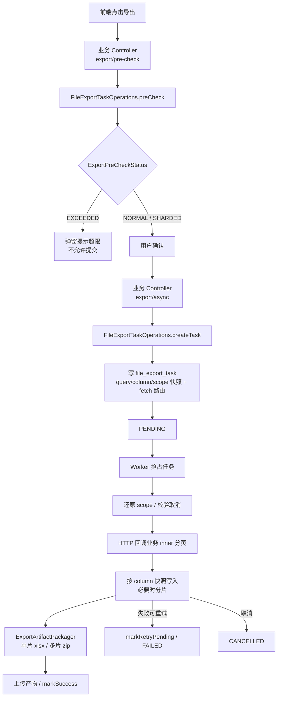

## 1. 概述与目标

### 1.1 背景

列表导出若在业务进程内同步生成，易阻塞请求线程，且难以统一进度、取消、重试与产物归属。需要将「建任务」与「执行导出」拆开，由文件服务作为任务中心统一调度。

单文件 Excel 过大时打开与内存成本不可控。超过分片阈值时由文件服务切成多片 xlsx 并打成一个 zip；超过总上限则拒绝导出，并给出可操作的提示。

### 1.2 设计目标

1. **创建时一次带齐上下文**：调用方提交 `bizType`、查询条件快照、导出列快照、取数回调（`fetchService` + `fetchPath`）、导出格式与幂等键；文件服务在创建时冻结数据权限快照。
2. **创建后由文件服务闭环**：Worker 抢占任务、按回调分页拉数、按列快照写临时文件（必要时分片打包）、上传产物并更新任务状态；业务侧不再参与编排。
3. **权限以创建时刻为准**：回调取数须还原 `scope_snapshot_json`，不得依赖执行时点的实时授权画像。
4. **可跨服务部署**：文件服务不依赖本 JVM 注册全部业务 Definition；路由信息落在任务记录上，不维护 file 侧静态路由表。
5. **取数路径统一为远程回调**：即便业务与文件同进程部署，分页取数仍走负载均衡 HTTP，避免产品级双模式。
6. **入口预检 + 执行硬校验**：创建前用 pre-check 估算行数并告知产物形态；Worker 执行时仍按同一套配额断言，防绕过与 total 漂移。

## 2. 职责边界

| 角色 | 职责 | 不得承担 |
|------|------|----------|
| 业务服务 | 对外提供 `export/pre-check`、`export/async`；组装请求（含列定义与取数路由）；实现 `@InternalApi` 分页取数 | 调度 Worker、写 Excel、分片打 zip、上传产物、维护任务状态机 |
| 文件服务 | 前置检查、持久化任务、租约抢占、分页写文件、分片打包、上传、成功/失败/取消/重试 | 感知具体业务 Mapper / 列表查询实现 |
| 调用方前端 | 提交筛选条件；pre-check 确认弹窗；查询任务进度 / 下载 | 传入 `fetchService` / `fetchPath` / 列快照原始结构；自行计算分片策略 |

> [!IMPORTANT]
> 分片与打 zip 是文件服务的事。业务 Fetcher 只分页吐 `Map`，不感知分片阈值与产物形态。

## 3. 总体流程



**状态**：`PENDING` → `RUNNING` → `SUCCESS` | `FAILED` | `CANCELLED`；另含 `CANCELLING`、`EXPIRED`。

Worker 以定时任务固定延迟拉取候选任务（配置项 `auth.file.export-task.poll-interval-ms`，默认 5000ms）。

## 4. 任务数据模型

### 4.1 三类快照

| 字段 | 写入方 | 内容 | 说明 |
|------|--------|------|------|
| `query_snapshot_json` | 业务创建请求 | 列表筛选条件（不含权限）| 与列表页 Query 同源序列化 |
| `column_snapshot_json` | 业务创建请求 | 导出列定义（`ExportColumn` 数组）| 创建时冻结表头与字段映射；Worker 写文件时只读该快照 |
| `scope_snapshot_json` | 文件服务创建时 | `userId`、`deptScope`、`permVersion` | 由当前 `AuthProfile` 冻结；**不得**写入完整 roles / permissions |

`scope_snapshot_json` 示例：

```json
{
  "userId": 9001,
  "deptScope": {
    "scopeType": "DEPT_AND_CHILD",
    "values": [1001, 1002, 1008]
  },
  "permVersion": 12
}
```

`scopeType` 为 `ALL` 时，`values` 为空数组。

`query_snapshot_json` 仅承载业务筛选，例如岗位列表：

```json
{
  "postCode": "DEV",
  "postName": "开发",
  "deptName": "研发中心",
  "status": true
}
```

`column_snapshot_json` 为 `ExportColumn` 数组的序列化结果，由业务侧 Helper 在创建时写入；文件服务校验并归一化后落库。列定义变更不影响已创建任务的产物结构。Worker 写表头只读该快照；行数据 `Map` 的 key 必须对齐 `fieldKey`。样式由文件侧默认挂上（如 `BLUE_GREY_TECH`），前端不传列结构。

### 4.2 取数路由（任务内嵌）

| 字段 | 示例 | 说明 |
|------|------|------|
| `fetch_service` | `service-system` | 服务发现名 |
| `fetch_path` | `/api/system/inner/export/page` | 内部分页路径 |
| `biz_type` | `SYS_POST` | 业务侧 Fetcher 路由键 |

文件侧不维护 `ExportRouteCatalog`；跨服务导出仅依赖任务记录中的路由字段。

### 4.3 其他关键字段

| 类别 | 字段 | 说明 |
|------|------|------|
| 进度 | `progress_percent`、`processed_rows`、`total_rows` | 执行过程回写；多片时仍按总行数计进度 |
| 租约 | `locked_by`、`lease_until` | 多实例 Worker 抢占与续租 |
| 重试 | `retry_count`、`max_retry`、`next_retry_at` | 失败退避 |
| 产物 | `file_record_id`、`expire_at` | 上传后的文件记录与过期时间 |
| 幂等 | `request_id` | 与 `created_by` 组合去重 |
| 失败信息 | `error_code`、`error_message` | 失败原因 |

另有尝试记录表 `file_export_attempt`（`task_id`、`attempt_no`、`worker_id`、`result` 等），用于审计单次执行结果。

查询 `VO` 暴露约定：

- **用户面**（如个人中心任务详情）：**不得**回传 `scope_snapshot_json`、`column_snapshot_json` 与租约字段。
- **管理端**（运维排查）：可回传租约字段（`locked_by`、`lease_until`）；仍**不得**回传 `scope_snapshot_json`。

## 5. 创建侧接入

### 5.1 Port 选型

| 部署形态 | 实现 | 说明 |
|----------|------|------|
| 与文件写服务同 JVM（如聚合 `service-system`）| `FileExportTaskWriteService`（实现 Port）| 本地调用写服务 |
| 独立业务服务（如 `service-example`）| `RemoteFileExportTaskOperations`（Feign）| 无 Local Bean 时由 `FileFeignAutoConfiguration` 装配 |

业务 Controller 只依赖 `FileExportTaskOperations`，不得直接依赖 Feign Client（架构测试约束以仓库为准）。

Port 方法：`preCheck`、`createTask`。创建请求核心字段：`bizType`、`exportFormat`、`querySnapshotJson`、`columnSnapshotJson`、`fetchService`、`fetchPath`、`requestId`、`createdBy`。权限快照由文件服务在创建时写入，不由调用方传入。前置检查请求不携带列快照，不落库。

### 5.2 对外接口约定

| 接口 | 入参 | 返回 | 说明 |
|------|------|------|------|
| `POST.../export/pre-check` | 列表 Query | `ExportPreCheckResult` | 估算行数与产物形态；不创建任务 |
| `POST.../export/async` | 列表 Query + 可选 `requestId` + `exportFormat`（默认 `XLSX`）| `FileExportTaskCreateResult.taskId` | 创建异步导出任务 |

**不得**由前端传入 `fetchService` / `fetchPath` / 列结构；由业务侧 Helper（如 `*FileExportTaskCreateRequests.preCheck/xlsx(...)`）写入默认路由与列定义。

### 5.3 创建时校验（文件服务）

须校验当前登录用户与 `createdBy` 一致；校验并归一化 `querySnapshotJson` / `columnSnapshotJson`；写入 scope 快照；按 `(created_by, request_id)` 做幂等；按用户限制进行中任务数量（`maxInProgressPerUser`）。

进行中状态计为：`PENDING`、`RUNNING`、`CANCELLING`。

### 5.4 接入示例（业务侧）

1. 定义 `bizType` 常量与导出列定义（手写或从 `@ExcelProperty` 生成）。
2. 提供 Helper：固化本服务的 `fetchService` / `fetchPath`；`preCheck(...)` 组装前置检查请求；`xlsx(...)` 序列化列快照并组装创建请求。
3. Controller：`POST.../export/pre-check` → `fileExportTaskOperations.preCheck(...)`；`POST.../export/async` → `createTask(...)`。
4. 实现 `@InternalApi` 内部分页接口，供 Worker 与 pre-check 回调。

同进程多业务（如 admin）可共用一个 inner 端点，经 `ExporttPageFetcherRegistry` 按 `bizType` 分发；独立微服务可使用专用 Controller / Fetcher。

## 6. 取数回调

### 6.1 Worker 调用方式

Worker 执行前还原 `scope_snapshot_json` 至 SecurityContext，并校验任务 `created_by` 与快照 `userId` 一致。随后使用负载均衡 RestTemplate 请求 `http://{fetchService}{fetchPath}`，请求体携带：`bizType`、`querySnapshotJson`、`scopeSnapshotJson`、`pageNum`、`pageSize`。出站由统一拦截器签发 `X-Internal-JWT`，并携带 `X-Internal-Call` 标识。

列快照不进入回调请求体：分页写文件由 `AsyncPagedExportExecutor` 完成，表头与字段映射取自任务上的 `column_snapshot_json`（`FileRemotePageDataSource` / `RemotePageFetcher`）。不提供「本 JVM 直接调业务 Bean」的产品级开关。

### 6.2 业务侧内部接口

- 路径约定：`/api/**/inner/export/**`。
- **必须**标注 `@InternalApi`，仅允许携带合法内部令牌的服务调用。
- 处理步骤：按 `bizType` 解析 Fetcher → 反序列化 Query → 用 scope 快照还原 SecurityContext → 分页查询并返回行数据（如 `ExportPageDataDTO`：`records` + `total`）。

回调参数须显式传递完整上下文（`bizType`、查询快照、权限快照、分页参数）。不以 `taskId` 反查文件库换取快照，避免业务服务与文件库表耦合。

前置检查与 Worker 共用同一取数路径：pre-check 以 `pageNum=1`、`pageSize=1` 取 `total`，不拉全量数据。

## 7. 安全与权限

1. 内部创建入口、前置检查入口与分页入口均须 `@InternalApi`（跨服务 Feign 走内部通道）；业务对外的 `export/pre-check`、`export/async` 走用户态鉴权。外部 `Authorization` 不得作为内部接口凭证。
2. 数据范围以创建时 `scope_snapshot_json` 为准。Worker 侧须还原快照，并校验 `created_by` 与快照 `userId` 一致；回调侧须按请求体内的 scope 快照还原 SecurityContext 后查询，不得改读执行时点实时画像。前置检查使用**当前登录用户**画像估行，与随后 create 冻结的 scope 在同一次用户操作链路内一致。
3. 取消、重试、下载等用户态接口须校验任务归属。
4. 出站内部 JWT：存在用户上下文时签发 USER 主体；无用户上下文（如纯服务调度）时签发 SERVICE 主体。Worker 在恢复创建人画像后发起回调，因此取数出站通常为 USER 主体。详见内部服务调用说明。

## 8. 配额、分片与产物形态

### 8.1 配置项

```yaml
auth:
  file:
    export-task:
      max-rows: 260000   # 单次任务总行数上限
      shard-rows: 50000  # 分片阈值；≤0 表示不分片
```

| 配置 | 含义 | 默认 |
|------|------|------|
| `max-rows` | 整次任务允许的最大行数，超过则失败 | `260000` |
| `shard-rows` | 单片 xlsx 行数阈值；超过则切多片并打 zip | `50000` |

### 8.2 判定规则

边界一律用 `>`（等于阈值仍视为单文件）：

| 条件 | 状态 / 行为 | 产物 |
|------|-------------|------|
| `totalRows ≤ shardRows` | 未超分片阈值 | 单个 xlsx |
| `shardRows < totalRows ≤ maxRows` | 需分片 | 多个 xlsx 打成 **一个 zip** |
| `totalRows > maxRows` | 超总上限 | 不可导出 |

示例：`shardRows=50000` 时，`50000` 行仍是 Excel；`50001` 行变为 ZIP（两片）。

分片数：`ceil(totalRows / shardRows)`（未超阈值时为 1）。ZIP 内条目命名：`{prefix}_part001.xlsx`、`{prefix}_part002.xlsx`…

进度仍按总行数回写；多片不改变任务状态机。

### 8.3 双校验

| 时机 | 组件 | 行为 |
|------|------|------|
| 入口（soft）| `FileExportPreCheckService` | 估 `total`，返回 `NORMAL` / `SHARDED` / `EXCEEDED`；`EXCEEDED` 时前端不得提交 |
| 执行（hard）| `ExportShardPolicy.assertWithinMaxRows` | Worker 拉首页 `total` 后再断言；超限抛 `ExportRowLimitExceededException`（人话：最多 N 行、当前约 M 行）|

> [!NOTE]
> 入口拦的是「别建注定失败的任务」；执行拦的是绕过 pre-check、以及 pre-check 与执行之间的数据漂移。两套判定共用 `ExportShardPolicy`，避免文案与行为分叉。

### 8.4 引擎职责划分

```text
module-file/export/
├── executor/AsyncPagedExportExecutor   # 分页循环、进度、取消、调用打包
├── shard/
│   ├── ExportShardPolicy               # 总上限 + 分片阈值
│   ├── ShardedExportSession            # 按行切多片临时文件
│   ├── ExportArtifactPackager          # 1 片透传；N 片打 zip
│   └── ChunkFileSession*               # 单片写盘会话契约
└── writer/XlsxChunkFileSession*        # xlsx 单片实现
```

业务 Fetcher 与前端均不依赖上述类。

## 9. 前置检查（Pre-check）

### 9.1 目的

1. 超限时立刻告诉用户「缩筛选」，而不是建任务再等失败。
2. 将要打成 ZIP 时明确告知，避免「点导t+出却下到 zip」的困惑。
3. 行数以服务端按当前筛选 + 当前 scope 回调得到的 `total` 为准，**不以**列表页 `pagination.total` 作权威依据。

### 9.2 调用链

```text
业务 Controller.exportPreCheck
  └→ FileExportTaskOperations.preCheck()
       ├─ 同 JVM → FileExportTaskWriteServiceImpl → FileExportPreCheckService
       └─ 跨服务 → RemoteFileExportTaskOperations (Feign)
                     → InternalFileExportTaskController
                       → FileExportTaskWriteServiceImpl → FileExportPreCheckService
```

`FileExportPreCheckService`：冻结当前用户 scope → 远程分页 `pageSize=1` 取 `total` → `ExportShardPolicy` 判定 → 返回 `ExportPreCheckResult`。

### 9.3 契约

`ExportPreCheckStatus`：

| 状态 | 含义 | `exportFormat` | `shardCount` |
|------|------|----------------|--------------|
| `NORMAL` | 未超分片阈值 | `XLSX` | `1` |
| `SHARDED` | 超阈值未超总上限 | `ZIP` | 实际分片数 |
| `EXCEEDED` | 超总上限，不可导出 | `null` | `0` |

结果字段：`status`、`totalRows`、`maxRows`、`shardCount`、`exportFormat`。

前置检查**不**创建任务、**不**写列快照、**不**消耗进行中任务配额。

## 10. 前端确认弹窗

跨业务复用 `components/domain/file/FilterAsyncExport`：

1. 点击导出 → 打开弹窗（隐藏默认 footer）→ 调用业务 `preCheckApi`。
2. 以 `el-result` 按三态展示；文案走 i18n（`fileExport.*`）。
3. `EXCEEDED`：仅关闭，不提交。
4. `NORMAL` / `SHARDED`：确认后调用 `asyncExportApi`（`export/async`）+ 幂等 `requestId`。
5. 提交成功提示前往「我的导出」查看。

各业务 `advanceAction` 传入 `preCheckApi` 与 `asyncExportApi`；不在前端拼 `fetchService` / 列定义。

任务列表的进行中轮询、详情视图属于任务中心体验，与导出引擎配额策略解耦，不在本章展开。
