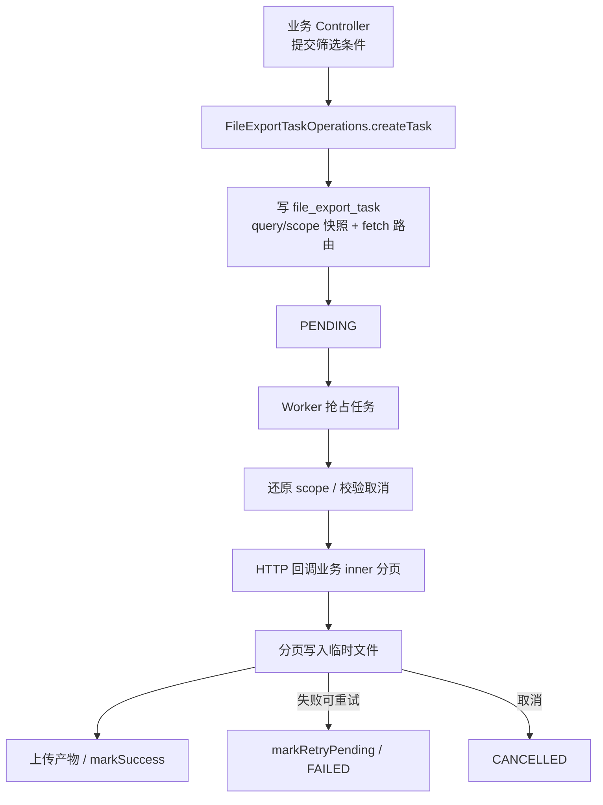

## 1. 概述与目标

### 1.1 背景

列表导出若在业务进程内同步生成，易阻塞请求线程，且难以统一进度、取消、重试与产物归属。需要将「建任务」与「执行导出」拆开，由文件服务作为任务中心统一调度。

### 1.2 设计目标

1. **创建时一次带齐上下文**：调用方提交 `bizType`、查询条件快照、取数回调（`fetchService` + `fetchPath`）、导出格式与幂等键；文件服务在创建时冻结数据权限快照。
2. **创建后由文件服务闭环**：Worker 抢占任务、按回调分页拉数、写临时文件、上传产物并更新任务状态；业务侧不再参与编排。
3. **权限以创建时刻为准**：回调取数须还原 `scope_snapshot_json`，不得依赖执行时点的实时授权画像。
4. **可跨服务部署**：文件服务不依赖本 JVM 注册全部业务 Definition；路由信息落在任务记录上，不维护 file 侧静态路由表。
5. **取数路径统一为远程回调**：即便业务与文件同进程部署，分页取数仍走负载均衡 HTTP，避免产品级双模式。

## 2. 职责边界

| 角色 | 职责 | 不得承担 |
|------|------|----------|
| 业务服务 | 对外提供 `export/async`；组装创建请求；实现 `@InternalApi` 分页取数 | 调度 Worker、写 Excel、上传产物、维护任务状态机 |
| 文件服务 | 持久化任务、租约抢占、分页写文件、上传、成功/失败/取消/重试 | 感知具体业务 Mapper / 列表查询实现 |
| 调用方前端 | 提交筛选条件与导出格式；查询任务进度 / 下载 | 传入 `fetchService` / `fetchPath` |

## 3. 总体流程



**状态**：`PENDING` → `RUNNING` → `SUCCESS` | `FAILED` | `CANCELLED`；另含 `CANCELLING`、`EXPIRED`。

Worker 以定时任务固定延迟拉取候选任务（配置项 `auth.file.export-task.poll-interval-ms`，默认 5000ms）。

## 4. 任务数据模型

### 4.1 两类快照

| 字段 | 写入方 | 内容 | 说明 |
|------|--------|------|------|
| `query_snapshot_json` | 业务创建请求 | 列表筛选条件（不含权限）| 与列表页 Query 同源序列化 |
| `scope_snapshot_json` | 文件服务创建时 | `userId`、`deptScope`、`permVersion` | 由当前 `AuthProfile` 冻结；**不得**写入完整 roles / permissions |

`scope_snapshot_json` 示例：

```json
{
  "userId": 9001,
  "deptScope": {
    "scopeType": "DEPT_AND_CHILD",
    "values": [1001, 1002, 1008]
  },
  "permVersion": 12
}
```

`scopeType` 为 `ALL` 时，`values` 为空数组。

`query_snapshot_json` 仅承载业务筛选，例如岗位列表：

```json
{
  "postCode": "DEV",
  "postName": "开发",
  "deptName": "研发中心",
  "status": true
}
```

### 4.2 取数路由（任务内嵌）

| 字段 | 示例 | 说明 |
|------|------|------|
| `fetch_service` | `service-system` | 服务发现名 |
| `fetch_path` | `/api/system/inner/export/page` | 内部分页路径 |
| `biz_type` | `SYS_POST` | 业务侧 Fetcher 路由键 |

文件侧不维护 `ExportRouteCatalog`；跨服务导出仅依赖任务记录中的路由字段。

### 4.3 其他关键字段

| 类别 | 字段 | 说明 |
|------|------|------|
| 进度 | `progress_percent`、`processed_rows`、`total_rows` | 执行过程回写 |
| 租约 | `locked_by`、`lease_until` | 多实例 Worker 抢占与续租 |
| 重试 | `retry_count`、`max_retry`、`next_retry_at` | 失败退避 |
| 产物 | `file_record_id`、`expire_at` | 上传后的文件记录与过期时间 |
| 幂等 | `request_id` | 与 `created_by` 组合去重 |
| 失败信息 | `error_code`、`error_message` | 失败原因 |

另有尝试记录表 `file_export_attempt`（`task_id`、`attempt_no`、`worker_id`、`result` 等），用于审计单次执行结果。

面向用户的查询 VO **不得**回传 `scope_snapshot_json` 与租约字段。

## 5. 创建侧接入

### 5.1 Port 选型

| 部署形态 | 实现 | 说明 |
|----------|------|------|
| 与文件写服务同 JVM（如聚合 `service-system`）| `FileExportTaskWriteService`（实现 Port）| 本地调用写服务 |
| 独立业务服务（如 `service-example`）| `RemoteFileExportTaskOperations`（Feign）| 无 Local Bean 时由 `FileFeignAutoConfiguration` 装配 |

业务 Controller 只依赖 `FileExportTaskOperations`，不得直接依赖 Feign Client（架构测试约束以仓库为准）。

创建请求核心字段：`bizType`、`exportFormat`、`querySnapshotJson`、`fetchService`、`fetchPath`、`requestId`、`createdBy`。权限快照由文件服务在创建时写入，不由调用方传入。

### 5.2 对外接口约定

- 入参：列表 Query + 可选 `requestId` + `exportFormat`（默认 XLSX）。
- **不得**由前端传入 `fetchService` / `fetchPath`；由业务侧 Helper（如 `*FileExportTaskCreateRequests.xlsx(...)`）写入默认路由。
- 返回：`FileExportTaskCreateResult.taskId`。

### 5.3 创建时校验（文件服务）

须校验当前登录用户与 `createdBy` 一致；写入 scope 快照；按 `(created_by, request_id)` 做幂等；按用户限制进行中任务数量（`maxInProgressPerUser`）。

### 5.4 接入示例（业务侧）

1. 定义 `bizType` 常量。
2. 提供 Helper，固化本服务的 `fetchService` / `fetchPath`。
3. Controller：`POST.../export/async` → `fileExportTaskOperations.createTask(...)`。
4. 实现 `@InternalApi` 内部分页接口，供 Worker 回调。

同进程多业务（如 admin）可共用一个 inner 端点，经 `ExportPageFetcherRegistry` 按 `bizType` 分发；独立微服务可使用专用 Controller / Fetcher。

## 6. 取数回调

### 6.1 Worker 调用方式

Worker 使用负载均衡 RestTemplate，请求 `http://{fetchService}{fetchPath}`，请求体携带：`bizType`、`querySnapshotJson`、`scopeSnapshotJson`、`pageNum`、`pageSize`。出站由统一拦截器签发 `X-Internal-JWT`，并携带 `X-Internal-Call` 标识。

分页写文件由 `AsyncPagedExportExecutor` 完成；取数数据源为远程实现（`FileRemotePageDataSource` / `RemotePageFetcher`）。不提供「本 JVM 直接调业务 Bean」的产品级开关。

### 6.2 业务侧内部接口

- 路径约定：`/api/**/inner/export/**`。
- **必须**标注 `@InternalApi`，仅允许携带合法内部令牌的服务调用。
- 处理步骤：按 `bizType` 解析 Fetcher → 反序列化 Query → 用 scope 快照还原 SecurityContext → 分页查询并返回行数据（如 `ExportPageDataDTO`：`records` + `total`）。

回调参数须显式传递完整上下文。不以 `taskId` 反查文件库换取快照，避免业务服务与文件库表耦合。

## 7. 安全与权限

1. 内部创建入口与分页入口均须 `@InternalApi`，外部 `Authorization` 不得作为内部接口凭证。
2. 数据范围以创建时 `scope_snapshot_json` 为准；Worker 与回调两侧均须还原并校验 `createdBy` 与快照 `userId` 一致。
3. 取消、重试、下载等用户态接口须校验任务归属。
4. 出站内部 JWT：存在用户上下文时签发 USER 主体；无用户上下文（如纯服务调度）时签发 SERVICE 主体。详见内部服务调用说明。
