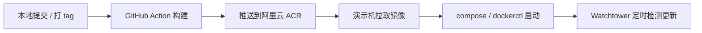

## 演示机部署

> [!NOTE]
>
> 个人演示环境实践笔记，不是规范。思路可复用（构建在哪做、镜像怎么到国内机器），具体 Secrets、路径、镜像仓库以你账号为准。本机构建调试 → 看 [[本地容器部署]]。

### 痛点

演示多半在国内：本机或弱鸡服务器上直接打包经常卡住；GitHub 拉源码、拉基础镜像也慢。要解决的是两件事——**构建放哪**、**镜像怎么落到演示机**。

### 思路（一种组合）

我的做法：代码推 GitHub → GitHub Action 打包 → 推阿里云 ACR → 演示机拉镜像起容器。对 `main` / `master` 提交（或打 `v*` 标签）后 CI 推镜像，演示机再拉即可。Watchtower 只是懒人更新，可换成 cron 或手动 `pull`/`up`。

换成腾讯云 TCR、自建 Harbor、或机器上直接 build 都行，只要上面两件事有着落。



### 前提

- GitHub Actions（`auth-server`、`auth-web` 各配一套 Secrets——用这套流水线时）
- 一个国内可达的镜像仓库（我用阿里云 ACR）
- 一台已装 Docker / Compose 的服务器（Nacos、数据库等中间件另行准备）

### 仓库里已有的工作流（示例）

仓库里已经有：

- `auth-server/.github/workflows/docker-push-acr.yml`
- `auth-web/.github/workflows/docker-push-acr.yml`

触发示例：推 `main` / `master`、打 `v*` 标签，或手动 `workflow_dispatch`。
后端大致：Maven 编一次 jar → 并行推 `service-auth`、`service-system`、`auth-gateway` 等服务。
前端单独构建推 `auth-web`。
镜像一般打两个标签，例如：`prod-<短 SHA>` 与 `prod-latest`。

### 阿里云 ACR

> [!TIP] ACR 个人版
> 个人演示一般够用。

[阿里云 ACR](https://cr.console.aliyun.com/cn-hangzhou/instance/dashboard) 选个人版，建命名空间后公开或私有自定。公开通常不用在机器上 login（我这边用的是私有）。

#### 1、私有仓库时在服务器登录

```bash
sudo docker login --username=xxx*****@qq.com registry.cn-hangzhou.aliyuncs.com
```

#### 2、GitHub Secrets

> [!IMPORTANT]
> 用这套 workflow 时，**每个仓库**都要填；命名是流水线里写死的，改 workflow 可以换名字。

| Secret | 示例 | 说明 |
| -------- | ------ | ------ |
| `ACR_REGISTRY` | `registry.cn-hangzhou.aliyuncs.com` | 仅域名，不要 `https://`，不要带命名空间 |
| `ACR_NAMESPACE` | `bunny-auth` | ACR 命名空间 |
| `ACR_USERNAME` | 阿里云账号邮箱等 | ACR 登录名 |
| `ACR_PASSWORD` |（访问凭证密码）| 控制台「访问凭证」，**不是**网站登录密码或 AccessKey |

### 演示机上怎么摆文件

演示机**不放完整源码**，只把各项目 `docker` 里运行时需要的文件拷过去（路径自定），再 login、拉镜像、启动——这是取舍，不是规定。别带上本地构建用的 `compose.override.yml`。

后端（来自 `auth-server/docker`）至少：

- `compose.yml`
- `dockerctl.sh`
- `env/service-system.env`（可由 `service-system.env.example` 复制后填写）

前端（来自 `auth-web/docker`）至少：

- `compose.yml`
- `dockerctl.sh`

到位后示例：

```bash
docker login registry.cn-hangzhou.aliyuncs.com
export AUTH_IMAGE_PREFIX=registry.cn-hangzhou.aliyuncs.com/<ns>
export AUTH_IMAGE_TAG=prod-latest

# 后端目录
./dockerctl.sh prod pull
./dockerctl.sh prod up

# 前端目录（需已有外部网络 auth-network）
export GATEWAY_HOST=<网关可达地址或服务名>
./dockerctl.sh pull
./dockerctl.sh up
```

每次发版都手动 pull / up 很烦。演示环境用 Watchtower 按间隔拉镜像并重建容器，有延迟；也可以用 cron。**只适合演示，正式环境别照搬。**

#### Watchtower 示例（可选）

更完整说明见 [[附录/部署/ARC 镜像轮询拉取]]。`--interval 300` 约 5 分钟一轮。

```bash
# 清除之前旧的
docker rm -f watchtower

# 按容器名轮询：auth-web / service-auth / service-system / auth-gateway
docker run -d --name watchtower --restart unless-stopped \
  -v /var/run/docker.sock:/var/run/docker.sock \
  -v /home/<user>/.docker/config.json:/config.json \
  nickfedor/watchtower \
  --interval 300 --cleanup \
  auth-web service-auth service-system auth-gateway
```
