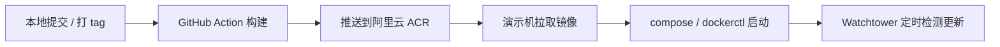

# 演示机部署指南

本文档用于说明个人演示环境的一种可行部署路径：在何处完成镜像构建，以及如何将镜像落到国内演示机并启动服务。本文为实践笔记，**不是**生产规范；Secrets、路径、镜像仓库名称请以实际账号与仓库配置为准。

本机构建与调试请参考相关本地部署说明；镜像定时拉取的完整参数见 [[ARC 镜像轮询拉取]]。

## 1. 背景与目标

演示机多位于国内网络环境，在弱配置服务器上直接打包或从 GitHub 拉取源码、基础镜像时，耗时与失败概率较高。部署时需明确解决以下两点：

1. **构建放在何处完成**
2. **镜像如何到达演示机**

## 2. 推荐思路

推荐链路如下：

| 环节     | 做法                                     |
| ------ | -------------------------------------- |
| 构建     | 代码推送至 GitHub 后，由 GitHub Actions 完成镜像构建 |
| 分发     | 将镜像推送至国内可达的镜像仓库（本文以阿里云 ACR 为例）         |
| 运行     | 演示机拉取镜像，通过 Compose / `dockerctl` 启动    |
| 更新（可选） | Watchtower、cron 或手动 `pull` / `up`      |

触发方式示例：向 `main` / `master` 提交，或打 `v*` 标签后由 CI 推送镜像，演示机再执行拉取与启动。亦可替换为腾讯云 TCR、自建 Harbor，或在服务器本机构建，只要上述「构建」与「落地」两件事有明确归属即可。



## 3. 前提条件

在开始配置前，请确认具备：

- GitHub Actions（使用仓库内现有流水线时，`auth-server`、`auth-web` 需分别配置 Secrets）
- 一台国内网络可达的镜像仓库（如阿里云 ACR）
- 一台已安装 Docker 与 Compose 的服务器（Nacos、数据库等中间件需另行准备）

## 4. 仓库内工作流说明

仓库中已提供如下工作流（示例）：

- `auth-server/.github/workflows/docker-push-acr.yml`
- `auth-web/.github/workflows/docker-push-acr.yml`

常见触发方式：推送至 `main` / `master`、打 `v*` 标签，或手动执行 `workflow_dispatch`。

- **后端**：Maven 编译 jar 后，并行推送 `service-auth`、`service-system`、`auth-gateway` 等服务镜像。
- **前端**：单独构建并推送 `auth-web`。
- **标签**：一般同时打 `prod-<短 SHA>` 与 `prod-latest`。

## 5. 阿里云 ACR 配置

个人演示场景下，ACR **个人版**通常即可满足需求。请前往 [阿里云 ACR 控制台](https://cr.console.aliyun.com/cn-hangzhou/instance/dashboard) 创建命名空间，并按需要选择公开或私有仓库。公开仓库在演示机上通常无需 `docker login`；私有仓库必须先登录（下文以私有为例）。

### 5.1 演示机登录私有仓库

```bash
sudo docker login --username=<阿里云账号> registry.cn-hangzhou.aliyuncs.com
```

### 5.2 GitHub Secrets


> [!IMPORTANT]
> 使用上述 workflow 时，**每个仓库**均需填写下列 Secrets。名称以流水线中的定义为准；若修改 workflow，可同步调整 Secret 名称

| Secret | 示例 | 说明 |
| -------- | ------ | ------ |
| `ACR_REGISTRY` | `registry.cn-hangzhou.aliyuncs.com` | 仅域名，不要包含 `https://`，不要带命名空间 |
| `ACR_NAMESPACE` | `bunny-auth` | ACR 命名空间 |
| `ACR_USERNAME` | 阿里云账号邮箱等 | ACR 登录名 |
| `ACR_PASSWORD` |（访问凭证密码）| 控制台「访问凭证」密码，**不是**网站登录密码或 AccessKey |

## 6. 演示机文件布局与启动

演示机**不必**放置完整业务源码。建议仅拷贝各项目 `docker` 目录下运行时所需文件（目标路径可自定），完成仓库登录后拉取镜像并启动。请勿将本地构建用的 `compose.override.yml` 一并带到演示机。

### 6.1 后端（来自 `auth-server/docker`）

至少包含：

- `compose.yml`
- `dockerctl.sh`
- `env/service-system.env`（可由 `service-system.env.example` 复制后填写）

### 6.2 前端（来自 `auth-web/docker`）

至少包含：

- `compose.yml`
- `dockerctl.sh`

### 6.3 启动示例

```bash
docker login registry.cn-hangzhou.aliyuncs.com
export AUTH_IMAGE_PREFIX=registry.cn-hangzhou.aliyuncs.com/<ns>
export AUTH_IMAGE_TAG=prod-latest

# 后端目录
./dockerctl.sh prod pull
./dockerctl.sh prod up

# 前端目录（需已存在外部网络 auth-network）
export GATEWAY_HOST=<网关可达地址或服务名>
./dockerctl.sh pull
./dockerctl.sh up
```

每次发版均手动执行 `pull` / `up` 成本较高。演示环境可选用 Watchtower 按间隔拉取镜像并重建容器（存在延迟），亦可使用 cron。**上述自动更新方式仅适用于演示环境，正式环境请勿照搬。**

## 7. 自动更新（可选）

更完整的参数说明与邮件通知示例见 [[ARC 镜像轮询拉取]]。以下示例中 `--interval 300` 表示约每 5 分钟检测一轮。

```bash
# 清除之前旧的
docker rm -f watchtower

# 按容器名轮询：auth-web / service-auth / service-system / auth-gateway
docker run -d --name watchtower --restart unless-stopped \
  -v /var/run/docker.sock:/var/run/docker.sock \
  -v /home/<user>/.docker/config.json:/config.json \
  nickfedor/watchtower \
  --interval 300 --cleanup \
  auth-web service-auth service-system auth-gateway
```

## 8. 常见问题与注意事项

- **Secrets 与仓库一一对应**
  `auth-server` 与 `auth-web` 的 Secrets 需分别配置；遗漏任一仓库将导致对应镜像无法推送。

- **`ACR_PASSWORD` 易用错**
  须使用 ACR 控制台「访问凭证」，不可使用阿里云网站登录密码或 RAM AccessKey。

- **演示机勿带完整源码与 override**
  只保留运行时 `docker` 文件；`compose.override.yml` 面向本地构建，带到演示机易造成路径或构建行为异常。

- **自动更新仅限演示**
  Watchtower / 定时拉取存在延迟，且会直接重建容器，不适合作为正式环境的发布机制。
